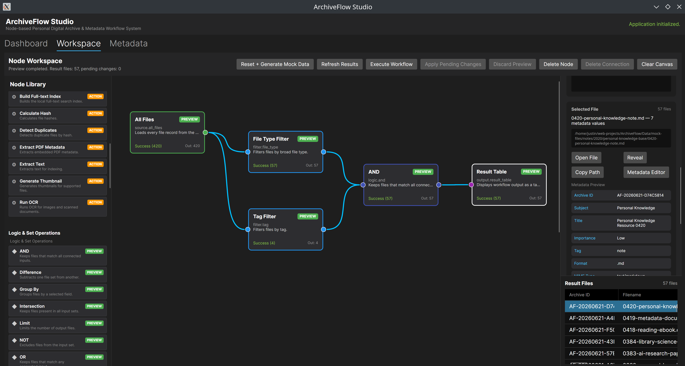

# ArchiveFlow Studio

**Node-based Personal Digital Archive & Metadata Workflow System**

ArchiveFlow Studio is a learning-focused desktop application for exploring metadata workflows, file organization, and digital archive review processes through a visual node canvas. It is built with C#/.NET, Avalonia UI, SQLite, and Dapper, and is currently used as a portfolio project for practicing desktop UI structure, local persistence, and library-information-inspired metadata workflows.


## 🖼️ System Showcase



The current screenshot shows the workflow canvas with connected source, filter, tag, logic, and result nodes. The side panels expose the node library, selected file metadata, and result table, reflecting the project goal: make archive-oriented file processing and metadata review easier to inspect visually.

## 🏆 Portfolio Significance & Outcomes

This project is presented as an in-progress learning project. It focuses on several practical software engineering and desktop application design patterns:
- **Custom UI Canvas Control**: Features a sophisticated node-based workflow editor built from scratch in Avalonia UI. It manages mouse pan/zoom matrices, node selection states, dynamic port connection rendering using Bezier curves, and drag-and-drop mechanics.
- **Modular Plugin System**: Implements a clean, interface-driven DLL plugin architecture using dynamic assembly reflection. This allows third-party developers to extend the node library with custom actions and file processor components.
- **Optimized Local Persistence**: Leverages a highly organized SQLite database schema paired with Dapper ORM. Includes SQLite FTS5 for lightning-fast full-text search capability across metadata fields and contents.
- **Multithreaded Execution Pipeline**: Employs an asynchronous, non-blocking background queue to execute heavy file indexing, thumbnail generation (using ImageSharp), and metadata extraction tasks smoothly.

##  Features

### Core Functionality
- **Visual Node-Based Workflow Editor**: Drag-and-drop interface for building complex file processing pipelines
- **Hierarchical Node Library**: Organized categories (Sources, Processors, Actions, Outputs, Relationships)
- **Real-time Canvas Interaction**: Pan, zoom, connect nodes with bezier curves
- **Node Parameter System**: Configure each node with text inputs, dropdowns, and numeric values
- **Background Job Queue**: Non-blocking execution for large-scale file processing
- **Plugin Architecture**: Extend functionality with external DLL plugins

### File Management
- **Multi-format Support**: Images, documents, code files, 3D assets, multimedia
- **Automatic Thumbnail Generation**: Image preview with ImageSharp
- **Content Preview**: Text extraction for TXT, MD, CSV, JSON files
- **Full-Text Search**: SQLite FTS5 integration for instant file discovery
- **Batch Operations**: Filter, tag, and process thousands of files simultaneously

### Metadata & Standards
- **EAV Metadata Model**: Entity-Attribute-Value schema for flexible metadata
- **Dublin Core Export**: Generate standards-compliant XML for library systems
- **Auto-Tagging**: Keyword-based automatic metadata assignment
- **File Relationships**: Create and visualize connections between files
- **Knowledge Graph**: Interactive network visualization of file relationships

### Professional Features
- **Workflow Save/Load**: Serialize workflows to JSON for reuse
- **Database Management**: Statistics, index rebuilding, maintenance tools
- **Export Options**: CSV, JSON, Dublin Core XML
- **Cross-Platform**: Windows, macOS, Linux support via Avalonia UI

## ️ Architecture

### Clean Architecture Layers

```
ArchiveFlow/
├── src/
│   ├── ArchiveFlow.Domain/          # Core entities, enums, rules
│   ├── ArchiveFlow.Application/     # Interfaces, use cases, nodes
│   ├── ArchiveFlow.Infrastructure/  # Database, file system, services
│   └── ArchiveFlow.App/            # Avalonia UI, ViewModels, Views
├── plugins/                         # External plugin projects
├── tests/                           # Unit and integration tests
└── Data/                            # Runtime data (gitignored)
```

### Technology Stack
- **Framework**: .NET 9.0
- **UI**: Avalonia UI 11 (Cross-platform XAML)
- **Database**: SQLite with Dapper ORM
- **Migration**: FluentMigrator
- **Image Processing**: SixLabors.ImageSharp
- **Architecture**: Clean Architecture + MVVM + Repository Pattern
- **Testing**: xUnit

## 📦 Installation

### Prerequisites
- .NET 9.0 SDK (for development)
- .NET 9.0 Runtime (for running published versions)

### From Source

```bash
# Clone the repository
git clone https://github.com/yourusername/ArchiveFlow.git
cd ArchiveFlow

# Restore dependencies
dotnet restore

# Build the solution
dotnet build

# Run the application
dotnet run --project src/ArchiveFlow.App
```

### From Release

1. Download the appropriate archive for your platform:
   - `ArchiveFlow-Studio-v1.0-linux-x64.tar.gz`
   - `ArchiveFlow-Studio-v1.0-win-x64.zip`
   - `ArchiveFlow-Studio-v1.0-osx-x64.tar.gz`

2. Extract the archive:
   ```bash
   tar -xzf ArchiveFlow-Studio-v1.0-linux-x64.tar.gz
   ```

3. Run the application:
   ```bash
   cd linux-x64
   ./ArchiveFlow.App
   ```

## 🚀 Quick Start

### 1. Generate Mock Data
- Launch the application
- Navigate to **Dashboard** tab
- Click **Generate Massive Mock Data** to create 200+ sample files

### 2. Create Your First Workflow
- Switch to **Workspace** tab
- From **Node Library** (left panel), drag nodes to the canvas:
  - `Sources` → `All Files`
  - `Processors` → `Filters` → `Filter .txt`
  - `Outputs` → `Result Table`
- Connect nodes by dragging from output port (right) to input port (left)
- Click **Execute Workflow** (F5)

### 3. Explore Knowledge Graph
- Navigate to **Graph Explorer** tab
- Click **Refresh File List**
- Select a file from the list
- View its relationships in the interactive graph

### 4. Export Dublin Core Metadata
- Add `Export Dublin Core XML` node to your workflow
- Connect it after your processing nodes
- Execute the workflow
- Check `Data/Exports/dublin_core.xml` for the output

##  Usage Guide

### Node Categories

#### Sources
- **All Files**: Load all files from the database
- **Folder Scanner**: Scan a specific folder path

#### Processors
- **Filters**: Filter by file extension (.txt, .md, custom rules)
- **Search**: Full-text search with keyword matching
- **DAG Logic**: Condition branches, merge operations

#### Actions
- **Metadata**: Add tags, set subjects, auto-tagging
- **Relationships**: Create links between files

#### Outputs
- **Result Table**: Display processed files
- **Export**: CSV, JSON, Dublin Core XML

### Keyboard Shortcuts
- `F5`: Execute workflow
- `Delete` / `Backspace`: Delete selected node
- `Ctrl+Z`: Undo (planned)
- `Ctrl+S`: Save workflow (planned)

### Context Menu
Right-click on the canvas to access:
- Add Node (categorized)
- Delete Selected
- Clear Canvas

##  Testing

```bash
# Run all tests
dotnet test

# Run tests with coverage
dotnet test --collect:"XPlat Code Coverage"

# View coverage report
# Open TestResults/*/coverage.cobertura.xml in a browser
```

## 📁 Project Structure

```
ArchiveFlow/
├── src/
│   ├── ArchiveFlow.Domain/
│   │   ├── Entities/          # FileRecord, MetadataField, FileRelationship
│   │   ├── Enums/             # FileStatus, DublinCoreElement
│   │   └── ValueObjects/      # Domain value objects
│   │
│   ├── ArchiveFlow.Application/
│   │   ├── Interfaces/        # Service contracts
│   │   ├── Nodes/             # Node implementations
│   │   │   ├── Query/         # Filter, Search, Condition nodes
│   │   │   └── Actions/       # Tag, Export, Relationship nodes
│   │   ├── Services/          # Application services
│   │   └── DTOs/              # Data transfer objects
│   │
│   ├── ArchiveFlow.Infrastructure/
│   │   ├── Database/          # SQLite, Migrations, Repositories
│   │   ├── FileSystem/        # File scanning, hashing
│   │   ├── Search/            # FTS5 integration
│   │   ├── Preview/           # Thumbnail generation
│   │   ├── Export/            # Dublin Core XML export
│   │   └── Services/          # Mock data, batch jobs, plugins
│   │
│   └── ArchiveFlow.App/
│       ├── Views/             # Avalonia XAML views
│       ├── ViewModels/        # MVVM view models
│       ├── Converters/        # Value converters
│       ── Assets/            # Icons, resources
│
├── plugins/
│   └── ArchiveFlow.SamplePlugin/  # Example plugin
│
├── tests/
│   ├── ArchiveFlow.Domain.Tests/
│   ├── ArchiveFlow.Application.Tests/
│   └── ArchiveFlow.Infrastructure.Tests/
│
├── Data/                      # Runtime data (gitignored)
│   ├── archiveflow.db         # SQLite database
│   ├── MockFiles/             # Generated test files
│   ├── Thumbnails/            # Generated thumbnails
│   ├── Exports/               # Exported files
│   ├── Workflows/             # Saved workflow JSON
│   ── Plugins/               # Loaded plugin DLLs
│
└── publish/                   # Published releases
    ├── linux-x64/
    ├── win-x64/
    └── osx-x64/
```

## 🔌 Plugin Development

Create custom nodes by implementing `INodePlugin`:

```csharp
public class MyPlugin : INodePlugin
{
    public string PluginId => "com.example.myplugin";
    public string PluginName => "My Custom Plugin";

    public IEnumerable<NodeDefinition> GetNodeDefinitions()
    {
        yield return new NodeDefinition
        {
            NodeType = "MyCustomNode",
            DisplayName = "My Custom Node",
            Category = "Custom",
            Factory = () => new MyCustomNode()
        };
    }
}
```

Compile to DLL and place in `Data/Plugins/` folder.

## 🤝 Contributing

Contributions are welcome! Please follow these steps:

1. Fork the repository
2. Create a feature branch (`git checkout -b feature/amazing-feature`)
3. Commit your changes (`git commit -m 'Add amazing feature'`)
4. Push to the branch (`git push origin feature/amazing-feature`)
5. Open a Pull Request

### Development Guidelines
- Follow Clean Architecture principles
- Write unit tests for new features
- Use English for code comments and documentation
- Ensure cross-platform compatibility

## 📄 License

This project is licensed under the MIT License - see the [LICENSE](LICENSE) file for details.

## 🙏 Acknowledgments

- **Avalonia UI**: Cross-platform UI framework
- **Dublin Core Metadata Initiative**: Metadata standards
- **ImageSharp**: Image processing library
- **Dapper**: Micro ORM for .NET
- **FluentMigrator**: Database migration tool

## 📧 Contact

- **Author**: [Your Name]
- **Email**: [your.email@example.com]
- **GitHub**: [@yourusername](https://github.com/yourusername)
- **LinkedIn**: [Your LinkedIn](https://linkedin.com/in/yourprofile)

## ️ Roadmap

- [ ] Real-time collaboration
- [ ] Cloud storage integration (S3, Azure Blob)
- [ ] AI-powered auto-classification (OpenAI, local models)
- [ ] OAI-PMH server for library harvesting
- [ ] Advanced graph analytics
- [ ] Mobile companion app
- [ ] Workflow marketplace

---

**Made with ❤️ using C# .NET and Avalonia UI**
